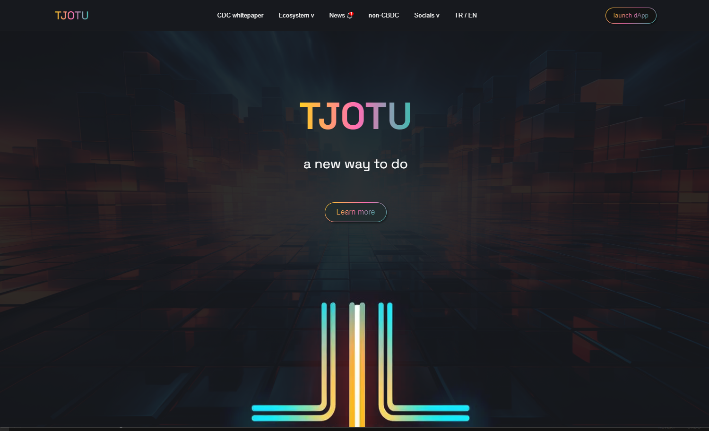

# Tjotu-Design Live Demo
https://tjotu-design.netlify.app/


# Figma Design
https://www.figma.com/file/JlS3iEIujL6vCHOKkbza5Q/Tjotu-Design?type=design&node-id=0-1&mode=design&t=6zJBdEnLpN1vIVI5-0


# Tjotu-Design
The Tjotu-Design project aims to streamline the process of turning a Figma design into functional code for desktop devices.
The project is built using the following technologies: Next.js, React, SCSS.



## Table of Contents

- [Installation](#installation)
- [Usage](#usage)
- [Scripts](#scripts)
- [Dependencies](#dependencies)
- [Contributing](#contributing)

## Installation

1. Clone the repository:

   ```shell
   git clone git clone https://github.com/yusufie/tjotu-design.git
    ```

2. Navigate to the project root directory:

   ```shell
   cd tjotu-design
   ```

3. Install the dependencies:

   ```shell
    npm install
    ```

## Usage

1. Start the development server:

   ```shell
   npm run dev
   ```
    This will start the Next.js development server and make the application available at http://localhost:3000.

2. Open the above URL in your web browser to see the project in action.


## Scripts

The following scripts are available:

- `dev`: Starts the Next.js development server
- `build`: Builds the Next.js application for production usage
- `start`: Starts the Next.js application in production mode
- `lint`: Runs ESLint to check for linting errors

You can run a script using the following command format:

```shell
npm run <script-name>
```

## Dependencies

The following dependencies are used in this project:

- `@types/node`: 20.2.5
- `@types/react`: 18.2.3
- `@types/react-dom`: 18.2.4
- `autoprefixer`: 10.4.14
- `eslint`: 8.42.0
- `eslint-config-next`: 13.4.4
- `next`: 13.4.4
- `postcss`: 8.4.24
- `react`: 18.2.0
- `react-dom`: 18.2.0
- `sass`: 1.64.1
- `typescript`: 5.1.3


## Contributing

Contributions, issues and feature requests are welcome!
